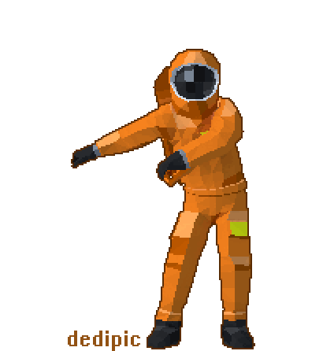

 

<!--  -->

  

###  About Me

Self-taught, **Google Certified Python Developer** with 5+ years of building things that live on the backend. I love turning complex problems into clean, scalable APIs and automating everything I can get my hands on.

-  Currently working with **LLM APIs, RAG pipelines** and **AI chatbots**
-  Built systems to automate complex and manual tasks.
-  Always learning -- currently deep into **LLM/RAG/STT/TTS** and **stock market technical analysis**
- Ask me about **Python, Django, APIs** or anything backend

###  Tech Stack

### What I've Built

- **AI Chatbots** -- LLM-powered WhatsApp bots with RAG architecture & file sharing
- **Marketing Automation** -- SalesX and HR recruitment tools
- **Fintech Platforms** -- APIs for loan processing, ENACH systems, live voting
- **Web Scrapers** -- Bots for automated data collection and analysis
- **CI/CD Pipelines** -- Automated deployments with GitHub Actions & Docker
- **Microservices** -- Service-based architectures for payment and NACH systems

### Certifications

### GitHub Stats

### Holopin Badges

### Thanks for stopping by! Let's build something awesome together.

*If it can be automated, it should be.*

**Open to collaborations on backend, API, and AI/LLM projects!**

